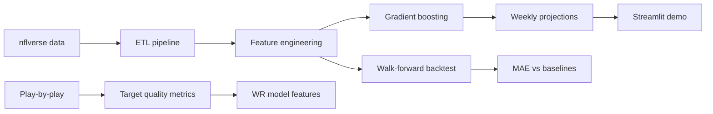

# ScoreSense Case Study

## Problem

Fantasy football managers need reliable weekly player projections. Most public projections are opaque black boxes. ScoreSense is an open, reproducible system that predicts PPR fantasy points for QBs, RBs, and WR/TE using public NFL data.

## Approach



### Data sources (free)

| Source | Use |
|--------|-----|
| nflverse weekly stats | Player box scores, EPA, air yards |
| nflverse play-by-play | Opponent defensive EPA, target quality |
| nflverse schedules | Home/away, rest days |

### Feature engineering

For each player-game, we compute **pre-game rolling averages** of:

- Volume stats (yards, TDs, attempts, targets)
- Efficiency (passing/rushing/receiving EPA)
- Usage share (target share, carry share, WOPR)
- Matchup context (opponent pass/rush EPA allowed)
- Schedule (days rest, home/away)

The model predicts same-week fantasy points (`Fpts`) from information available before kickoff.

### Model

Position-specific **Gradient Boosting Regressors** (scikit-learn) with unified feature columns defined in `src/features.py`. Training uses 2018–2023; evaluation uses walk-forward holdout on 2024.

### Evaluation

Walk-forward backtest comparing:

1. **ScoreSense model** — gradient boosting on engineered features
2. **Season average baseline** — player’s season-to-date average before each game
3. **Last game baseline** — previous week’s fantasy points

Metrics: MAE, RMSE, Spearman rank correlation, top-12 overlap by week.

Results (2024 holdout):

| Position | Model MAE | Baseline MAE | Improvement |
|----------|-----------|--------------|-------------|
| QB | 5.02 | 6.60 | 23.9% |
| RB | 4.77 | 5.02 | 5.0% |
| WR/TE | 4.70 | 4.76 | 1.3% |

See `outputs/backtest/backtest_summary.json` and [docs/EVALUATION.md](EVALUATION.md) for full metrics.

## Differentiators

1. **Reproducible pipeline** — one command rebuilds data, trains, and evaluates
2. **Train/serve alignment** — single feature definition in code, not divergent PFF vs training CSV schemas
3. **Usage-first features** — target share and EPA beyond raw box scores
4. **BDB companion** — target quality metrics bridge toward NGS tracking analytics

## Demo

```bash
streamlit run app/streamlit_app.py
```

## What I’d do next

- Add prediction intervals (quantile regression)
- Integrate Sleeper API for injury-driven opportunity adjustments
- Replace target quality proxies with BDB 2026 NGS tracking features
- Deploy FastAPI + React dashboard with weekly cron refresh

## Tech stack

Python, pandas, scikit-learn, nfl_data_py, Streamlit, FastAPI, matplotlib
