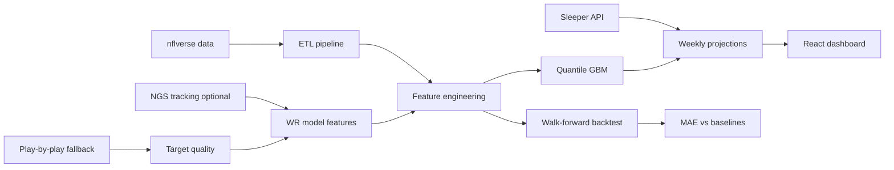

# ScoreSense Case Study

> 2024 portfolio write-up of the projection pipeline. **Not** current product IA.  
> Product, brand, and design: [PRODUCT.md](./PRODUCT.md). Canonical metrics: [EVALUATION.md](./EVALUATION.md).

## Problem

Fantasy football managers need reliable weekly player projections. Most public projections are opaque black boxes. ScoreSense is an open, reproducible system that predicts PPR fantasy points for QBs, RBs, and WR/TE using public NFL data.

## Approach



### Model

Position-specific **quantile gradient boosting** (P10 / P50 / P90) with unified features in `src/features.py`. The P50 estimate is the headline projection; P10–P90 form an 80% prediction interval.

### v3 capabilities

| Feature | Implementation |
|---------|----------------|
| Prediction intervals | `src/ml/quantile.py` — sklearn quantile GBM |
| Opportunity adjustment | `src/core/opportunity.py` + Sleeper injury status (`src/integrations/sleeper.py`) |
| NGS tracking | `bdb_companion/ngs_tracking.py` — reads `data/raw/ngs/` |
| React dashboard | `frontend/` + `app/api.py` |
| Weekly cron | `src/jobs/weekly_refresh.py` + GitHub Actions |

### Evaluation

Walk-forward backtest comparing:

1. **ScoreSense model** — gradient boosting on engineered features
2. **Season average baseline** — player’s season-to-date average before each game
3. **Last game baseline** — previous week’s fantasy points

Metrics: MAE, RMSE, Spearman rank correlation, top-12 overlap by week.

Results (2024 holdout):

| Position | Model MAE | Baseline MAE | Improvement |
|----------|-----------|--------------|-------------|
| QB | 5.02 | 6.60 | 23.9% |
| RB | 4.77 | 5.02 | 5.0% |
| WR/TE | 4.70 | 4.76 | 1.3% |

See `artifacts/backtest/backtest_summary.json` and [docs/EVALUATION.md](EVALUATION.md) for full metrics.

## Differentiators

1. **Reproducible pipeline** — one command rebuilds data, trains, and evaluates
2. **Train/serve alignment** — single feature definition in code, not divergent PFF vs training CSV schemas
3. **Usage-first features** — target share and EPA beyond raw box scores
4. **BDB companion** — target quality metrics bridge toward NGS tracking analytics

## Demo

```bash
# API + React dashboard (dev)
.venv\Scripts\uvicorn app.api:app --reload --port 8000
cd frontend && npm install && npm run dev

# Production build (API serves React from frontend/dist)
cd frontend && npm run build
.venv\Scripts\uvicorn app.api:app --host 0.0.0.0 --port 8000

# Weekly cron refresh
.venv\Scripts\python -m src.jobs.weekly_refresh

# Docker
docker compose up api
docker compose --profile cron run refresh
```

## What I’d do next

- Deploy to Render/Railway with managed cron (workflow in `.github/workflows/weekly-refresh.yml`)
- Add ESPN/FantasyPros projection baselines to backtest
- Build BDB broadcast visualization for in-air player movement
- Conformal prediction for better-calibrated intervals

## Tech stack

Python, pandas, scikit-learn, nfl_data_py, FastAPI, React, Vite, Sleeper API, Docker
