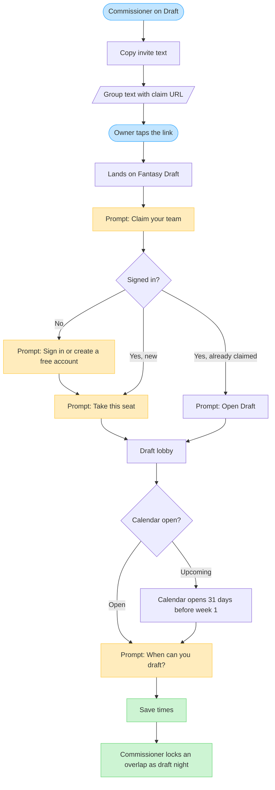

# Invite owners by text

How a commissioner texts one link so owners **claim a team** and **mark nights that work**.

User-facing product area is **Fantasy**. Names and chrome: [PRODUCT.md](./PRODUCT.md). Auth and email details: [ONBOARDING.md](./ONBOARDING.md).

ScoreSense does not send SMS. You copy the invite from **Draft** (or Roster management → Access) and paste it in the group text.

---

## Text to send

Copy **Copy text** on Draft, or paste this and replace the URL:

```
You're in {league name} on ScoreSense.
Open this, claim your team, then mark nights that work.

https://<your-app>/hub/draft?claim={token}
```

That URL is the **invite link** (`?claim=`). Do not send the **member draft link** (room code) until they already have a seat — that one only opens the room.

---

## Flowchart



---

## What they receive, where they land, what they are asked

| Who | They receive | They land on | They are asked to |
|-----|--------------|--------------|-------------------|
| Owner (group text) | Invite link `…/hub/draft?claim=…` | **Draft**, with the **Claim your team** overlay | Sign in → pick their franchise → **When can you draft?** → **Save times** |
| Owner who already claimed | Same link | **Draft**, overlay says the seat is already theirs | **Open Draft**, then mark nights if they have not |
| Owner (email lock) | Email with `…/hub/draft?invite=…` | **Draft**, with the **League invite** overlay | Sign in as that **exact email** → **Join league** → mark nights |
| Member on draft night | Member draft link (room code) | Draft lobby / live room | Walk in. This link does **not** give out a seat |

Root URLs (`/?claim=`, `/?invite=`) still redirect to Draft and keep the token.

---

## Owner screens (claim link)

1. **Sign in to claim a team** — if they have no ScoreSense account. Google is the lead option; email is secondary. After auth they return to the same `?claim=` URL.
2. **Claim your team** — list of unclaimed franchises. Tap **Take this seat**. Seats reserved by a pending email invite are hidden. If the league still has unused configured seats, they can name a new one.
3. **Draft lobby** — **When can you draft?** Shared calendar. Tap current or future hours, then **Save times**. Hours that already passed today are hidden.
4. **Home** also surfaces **Mark times** until they save at least one night in the open window.

They do **not** need Sleeper for this text. Linking a Sleeper roster is a later Setup step.

---

## Calendar window

One calendar per league. Hours are 12 p.m. through 10 p.m. in the league draft timezone (default America/New York).

| State | When | What owners see |
|-------|------|-----------------|
| Upcoming | More than 31 days before the first NFL game | “Opens soon.” They can claim now; marking times waits. |
| Open | 31 days before week 1 through the day before kickoff | Mark evenings. Heat shows who is free. |
| Closed | Day of the first NFL game and after | Calendar closed. Draft night is the commissioner’s call. |
| Night locked | Commissioner locked an overlap | Chip: **Night locked**. Owners can still mark other times if it has to move. |

Commissioners lock a promising overlap from **Nights that already overlap** on the same Draft page. That becomes draft night. The room can auto-start then.

---

## Two links (do not mix)

| Link | Query | Who it is for | What it does |
|------|-------|---------------|--------------|
| Invite link | `?claim=` | People who still need a seat | Sign in, pick an open team, then the calendar |
| Member draft link | Room code path | People already on the league | Opens the lobby / live room. Strangers cannot take a seat |

Copy the invite link for the group text. Save the member draft link for draft night.

---

## Optional: lock one seat to one email

Use **Roster management → Access** (or Admin) only when a franchise must go to one address:

1. Enter manager email + exact team name.
2. ScoreSense emails `?invite=` (14-day token) when SMTP is configured; otherwise copy the link yourself.
3. They must sign in as that email and tap **Join league**.
4. That seat is reserved and hidden from the group claim list until the invite expires or you revoke it.

Co-commissioner is a checkbox on that email invite (primary commissioner only).

---

## Commissioner checklist

1. **Draft** → copy **Copy text** (or **Copy** for the URL only).
2. Paste in the group thread. Tell people which franchise is theirs if names are not obvious.
3. Watch **The room** on Draft as seats fill.
4. When overlaps appear, **Lock this night**.
5. On draft night, share the **member draft link**, not a new claim link.

Turn the claim link off or rotate it from Draft or Access if the URL leaked. People who already claimed stay. **Lock team claims** (Access) is a separate control for later roster edits.

---

## Blocked states owners may see

| Overlay | Meaning |
|---------|---------|
| This invite link is turned off | You disabled text-link claims. Send a new link or turn it back on. |
| This league is no longer taking claims | Draft is live or already completed. |
| Every seat is claimed | No open franchise and no unused configured seat. |
| Wrong account — sign in as {email} | Email invite: they signed in as a different address. |
| This invite is no longer active | Email invite expired, accepted, or revoked. |
