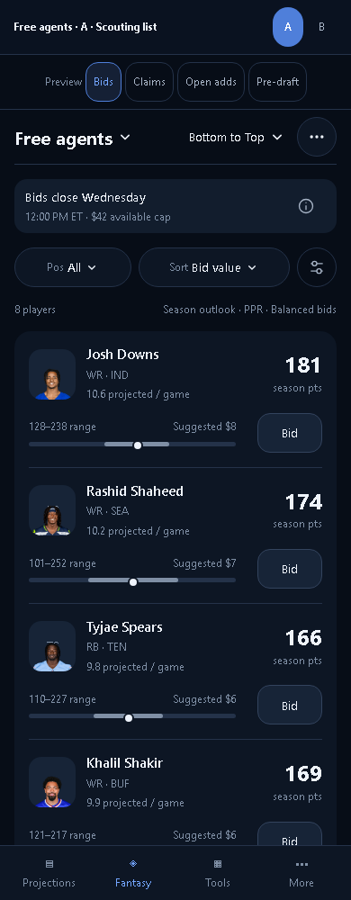
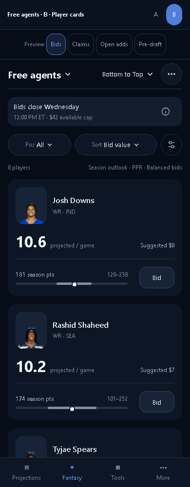
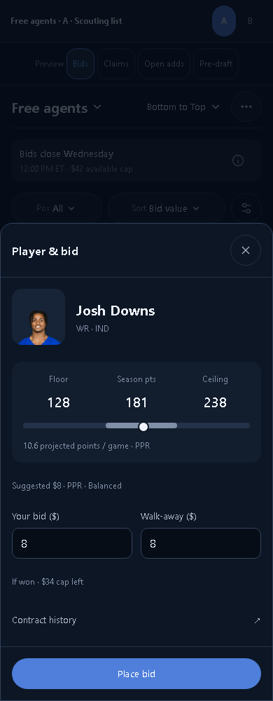
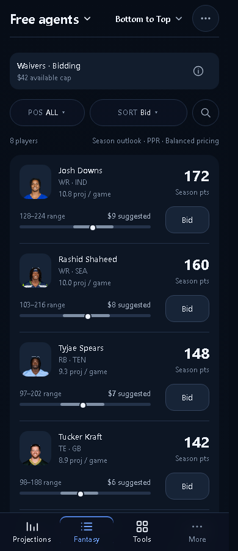
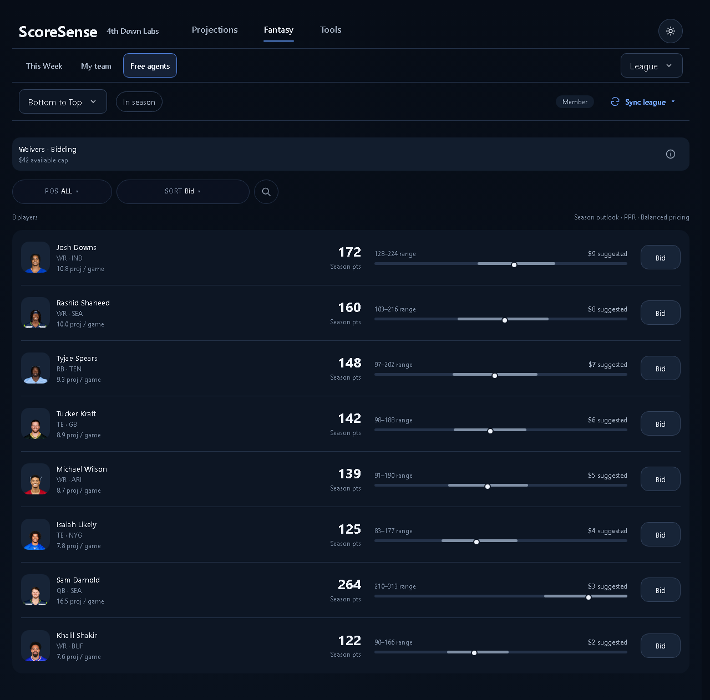
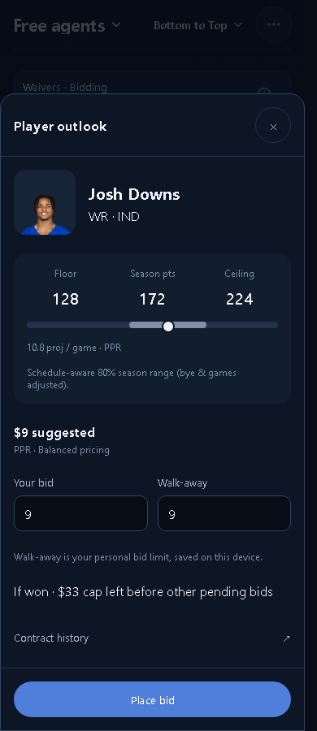

# Free agents mobile options

September 29, 2026. **Option A approved** by the user ("lets go with A"). B remains an alternative, not the production direction.

The implementation uses the existing acquisition calendar and player data. The real API currently provides window labels and explanatory text, not an exact closing timestamp, so the sample Wednesday deadline is not hardcoded into the product.

- **A — Scouting list:** compact headshots, season projections, per-game pace, a shared-scale floor–ceiling graphic, and the current acquisition action.
- **B — Player cards:** larger portraits and projected points per game, with season outlook underneath. One player pool, no duplicated recommendation rail.

Both reuse the approved compact Fantasy header. Desktop keeps the league switcher left. Player sheets are included in the options: auction bid and personal walk-away, priority claim with conditional drop, immediate add, and pre-draft lock with draft stars. Search, position, sort, and outlook filters work in the sample data. Nothing writes to a league.

Outlook numbers and acquisition dates are illustrative. The design uses fields already available on the board: season median, floor, ceiling, per-game projection, and suggested bid. It does not invent recent-game trends, ownership percentages, or weekly forecasts. Identity/headshot mappings come from the existing player cache.

## Verification

| Check | 320 | 390 | 1280 |
| --- | --- | --- | --- |
| A and B layout/state audit | PASS | PASS | PASS |
| Bid, claim, add, locked state; no-money fields | PASS | PASS | PASS |
| Search, walk-away validation, Escape, draft stars | PASS | PASS | PASS |

48 layout/state checks, zero rule failures or page overflow, all eight headshots loaded. Repository layout-audit commands also pass for both options at 390 and 1280. Screenshots visually inspected at all three widths, including player sheets and long names. Six previous Home/This Week/My team mocks pass the compact-header regression at 320.

The shared mock header now gives the destination its natural width (up to 55%) and truncates the quieter league name first. This keeps Free agents readable at 320 without making the row taller.

Sample player actions show preview feedback only. Header navigation and contract-history links use the existing preview navigation feedback. The real acquisition calendar, league capabilities, contract rules, and permissions remain authoritative during implementation.

## Screenshots

## Approved A implementation

Local preview: `http://127.0.0.1:5173/test-fixtures/free-agents-mobile.html`. This uses the real React components with isolated sample league writes. The actual destination is `/hub/free-agents`.

- 61 layout/state checks pass at 320, 390, and 1280, with no page overflow or browser errors. Covers bid and walk-away validation, persisted ceilings, cap limits, claim/drop/cancel, commissioner priority, protection, readonly, missing projections, loading, empty, failed writes, failed claim loading, long names, draft stars, focus restoration, phone pagination and desktop virtualization through player 240.
- Production build passes. 60 targeted frontend/layout tests and 36 product/registry tests pass.
- Full frontend suite: 878 of 882 pass. Four unchanged baseline failures: draftRoomHelpers contract wording, two rosterFormat contract labels, and accuracyPresentation zero-value wording. The separate 19 layout-audit unit tests pass.
- All 34 registered routes were audited at 390 and 1280. Type, native-select, collision and grid gates pass on every route. Existing full-audit findings remain on other pages (touch sizes, multiple primary actions and table sizing).
- Final real-league Free agents audit: desktop PASS; phone has one existing shared league-chat dismiss target at 29px instead of 44px. Free agents controls and the new compact header pass. The chat launcher was not redesigned in this change.
- Screenshots visually inspected on phone and desktop. Real local league data was read; real acquisitions and production deployment were not performed. Sample action tests cannot establish live server transaction outcomes.

