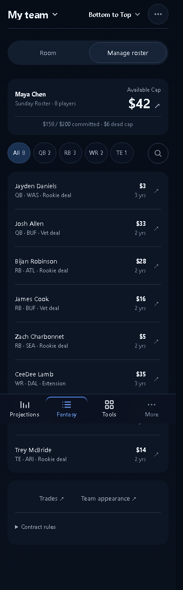
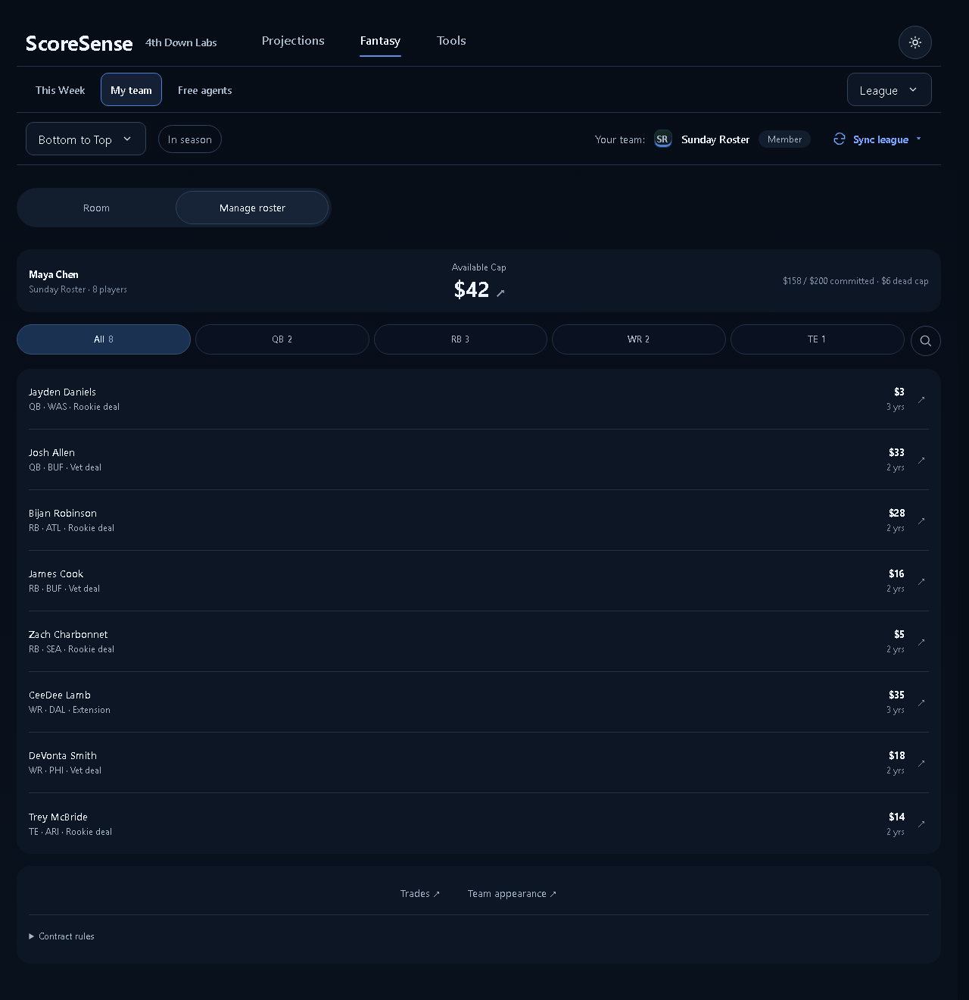
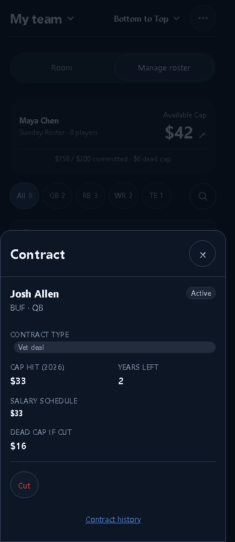
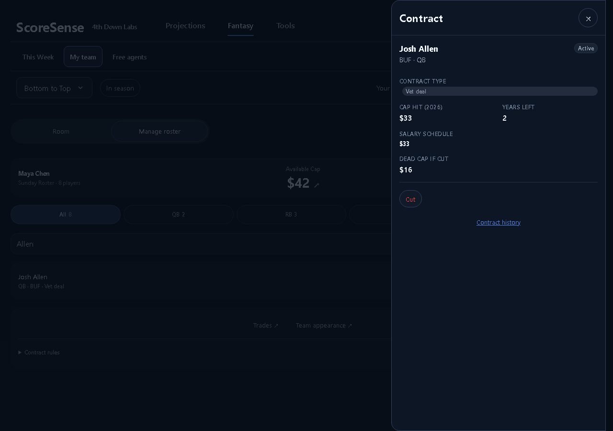

# My team A — implementation review

Approved September 29, 2026. Manage roster follows [option A](../fantasy-team-a.html), including the full-width team/cap summary above the roster. Room remains the default league view.

## Changes

- Compact owner/team identity with phase-aware remaining cap from the same server summary as Cap.
- Position filters with counts, search on demand, one interactive player row, aligned salary and term.
- Contract details use a phone bottom sheet / desktop side sheet with focus trapping, Escape, focus return, and nested confirmation support.
- Preserved extension, undo, cut, contract history, appearance and staff-only removal. Contract actions retain their existing API paths and permissions.
- Non-salary leagues omit money and contract fields. Empty rosters hide filters; roster loading uses a skeleton.
- My team uses the approved single-row mobile Fantasy header. The desktop league picker stays left aligned.

## Verification

| Surface | 320 | 390 | 1280 |
|---|---|---|---|
| Salary / standard / pre-draft / empty / loading | PASS | PASS | PASS |
| Contract details, filters, search, focus, cut cancel/error, extension/undo | PASS | PASS | PASS |
| Long names, staff/member controls, claimed-player undo restriction | PASS | PASS | PASS |

`node scripts/dev/my_team_check.mjs` uses isolated sample data. Fixture requests never contact a league. See [audit.json](audit.json).

`node scripts/dev/my_team_live_check.mjs` opens local snapshot routes: My team, Home, This Week, Game center, Cap, and Rules. The changed summary/header checks pass at 390 and 1280. Full-route audit has existing failures: the 29px chat-dismiss target on phone and an extra signed-out Sign in primary on desktop. These unrelated primitives were not changed. See [live-audit.json](live-audit.json).

Frontend production build passes. The 50 focused frontend/layout tests pass. Full frontend suite: 897 pass, 4 existing failures in unchanged contract-label and accuracy-copy tests. Full Python gate result recorded in the PR.

No production roster writes, Sleeper actions, or rule changes were performed during verification. Room was opened through the real route; its artwork, sharing, and nickname editing were not re-tested.

## Screenshots

