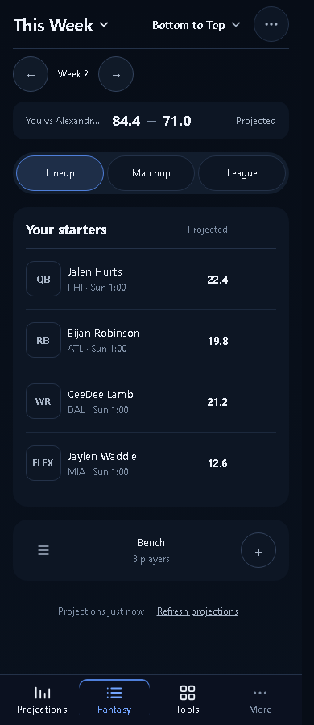
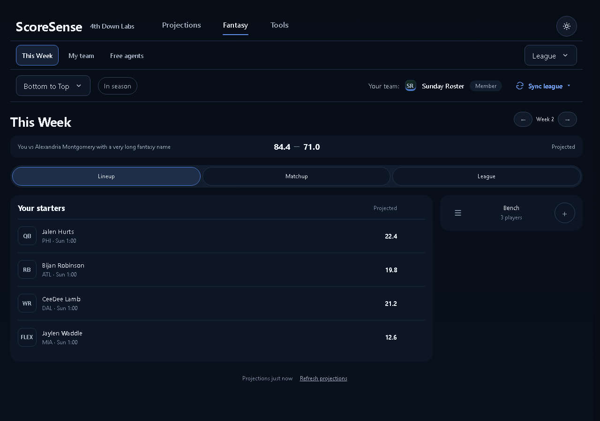

# This Week summary correction

The optional K/DEF estimate note took a full row of flex space without wrapping and compressed the matchup label. Removed that note at the user's request and gave identity, totals and state explicit grid columns. Long identities truncate while retaining their full text in the accessible content and title.

## Verification

| Check | Result |
|---|---|
| 320 / 390 / 1280 / 1720; projected, specialists, missing, live and final; long opponent | PASS, 20 scenarios |
| Forecast primitive on `/hub/week` and `/hub/game`, 390 and 1280 | PASS |
| Full route audits, 390 | Existing chat-dismiss touch-target failure |
| Full route audits, 1280 | Existing extra Sign in primary failure |
| Product/living-surface tests | 36 passed |
| Matchup presentation/layout-audit tests | 42 passed |
| Production build | PASS |

No production lineup writes or external Sleeper actions were exercised. My team static options were updated locally to Available Cap after draft and Leftover for draft before draft; this naming convention is recorded in the product rules for implementation after the option is chosen.