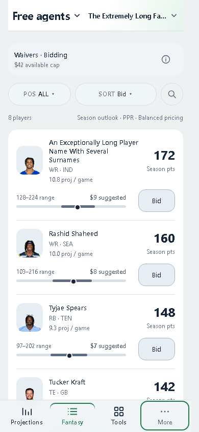
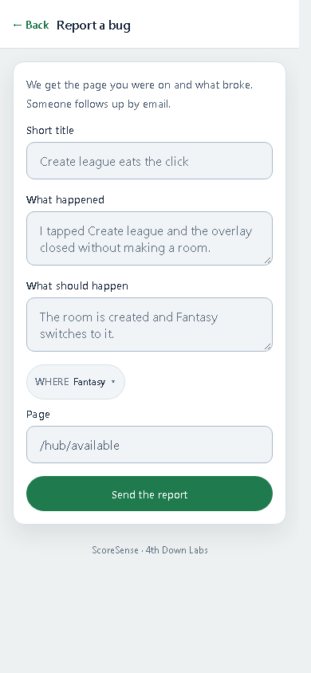
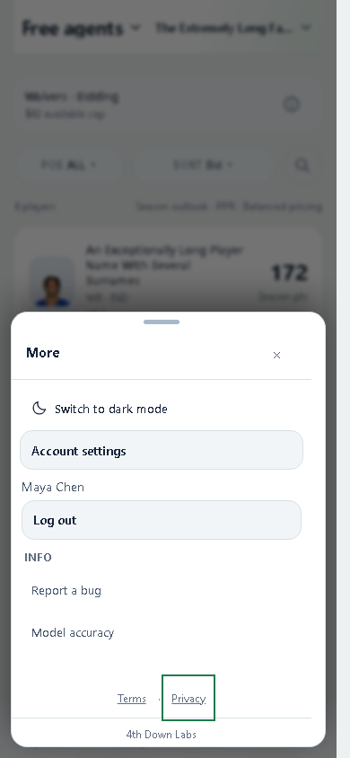

# Mobile navigation and utility cleanup

Small follow-up to the approved Free agents A implementation, included in PR #580.

- One More button in the bottom navigation; compact header has an internal text inset.
- Mobile main destinations match desktop. League opens the same secondary pages and preserves permission/capability filters.
- Shared sheets trap and restore focus, respect reduced motion, fit the dynamic viewport, and keep 44px controls.
- Bug reporting uses the shared standalone surface, readable form fields, and accessible result/error messages.
- Admin forms wrap on phones; account and league lists no longer show an empty message over real rows. League details use controlled expansion.
- Legal/account/SMS pages retain their wording and permissions; shared reading and form spacing remain consistent.

## Focused verification

Production build and 16 targeted navigation/report/admin tests pass. `node scripts/dev/check_mobile_chrome.mjs` passes 31 layout/state checks at 320, 390, and 1280px. The check covers long header names, one More button, primary/secondary destinations, current-page dismissal, focus containment/return, report fields, admin overview/users/leagues/detail, Terms, Privacy, Account, and SMS. No horizontal overflow or browser errors.

Inspected phone screenshots in dark and light modes. These isolated fixtures use sample data and intercept all writes; no report, account, or admin changes were sent to a real service. This is a focused polish pass, not a complete utility workflow audit.

