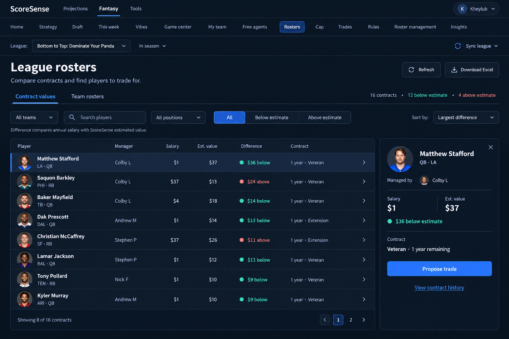

# Rosters: approved table and details layout

The user approved this concept on September 10, 2026 and explicitly asked that it take priority over conflicting layout rules.

The implementation uses the existing app navigation and real roster API. The concept's example figures and generated portraits are illustrative, not production data.

- Compact League rosters heading with Refresh and Download Excel.
- Contract values / Team rosters tabs, searchable manager picker, player search, position and value filters, and sorting.
- Balanced table columns for player, manager, salary, estimate, difference, and contract. Eight rows per page replace virtualization.
- Selected-player details own trade and contract-history actions. At laptop widths the panel moves below; on phone it opens beneath the selected row.
- Existing tokens, larger readable type, blue selection/action, teal below-estimate and coral above-estimate text. No manager rail, hero band, At a glance card, or repeated row buttons.

Rules updated in PRODUCT.md, the living-surface registry, and the relevant .cursor rules. The scoped table-width exception prevents an oversized player column; alignment, contrast, target size, and overflow checks still apply. The approved design also skips the usual request for additional mock options.

## Verification

Run `npm run dev` from frontend, then `node scripts/dev/rosters_browser.mjs` from the repository root. It mounts the actual component at `/test-fixtures/rosters.html` with isolated data and mocked API calls. The production Vite build includes only index.html, not this fixture. Optional `PLAYWRIGHT_MODULE` (module URL) and `PLAYWRIGHT_CHANNEL` select an installed browser runtime.

The browser checks exercise selection/dismissal/focus, trade seeding, history callbacks, manager search, player search, value filters, pagination reset, offseason locks, refresh failure, empty results, and league-change loading. They run the repository's layout measurements and save screenshots at 1536, 1440, 1280, 1024, and 390 pixels.

These are component checks, not authenticated end-to-end checks of the app shell, live league data, workbook download, or the receiving trade/history screens. Cap, My team, Rules, and other destinations were not changed or visually rechecked.
