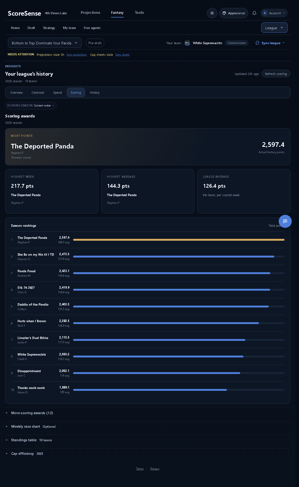
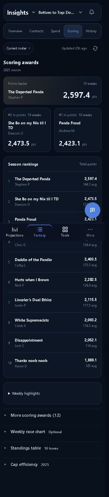

# Insights responsive review — October 5, 2026

Approved direction: A Spotlight on desktop; B Comparison on phone for Contracts, Scoring and Spend. Overview keeps the approved B season story.

Visually reviewed the running React app at 1280, 390 and 320px. Scoring and spending use the saved local Panda snapshot. Filled contract ranking cases use isolated browser fixtures; those fixtures are never written to the app or league storage.

| Insights route | 1280 | 390 |
| --- | --- | --- |
| Overview | PASS | PASS |
| Contracts | PASS | PASS |
| Spend | PASS | PASS |
| Scoring | PASS | PASS |
| History | PASS | PASS |

- All 39 browser layout cases passed, including expanded spending tables, position leaders, charts, scoring standings, awards, and cap efficiency. All five tabs also passed at 320px.
- Empty, loading, error, read-only, non-salary and long-name states passed.
- Layout regressions cover balanced phone tab insets, shared scoring column tracks, aligned supporting award values and filter-to-content spacing. Temporarily restoring independent scoring row columns, cramped tabs and shifted award values makes the new checks fail.
- Contract period/sort changes took 64ms at 1280, 104ms at 390 and 123ms at 320, with zero additional Insights requests. These are local browser measurements, not a production load-time guarantee. Scoring and Spend retain their saved section requests; charts remain lazy.
- Production build and product/registry tests pass. The full frontend run has the same three existing failures: locked auction contract copy, Accuracy copy and the stale My team living-surface assertion. The new Insights tests pass.
- Other Fantasy destinations, including My team, Cap and Rules, were not rechecked for this Insights-only change.

## Desktop

## Phone

