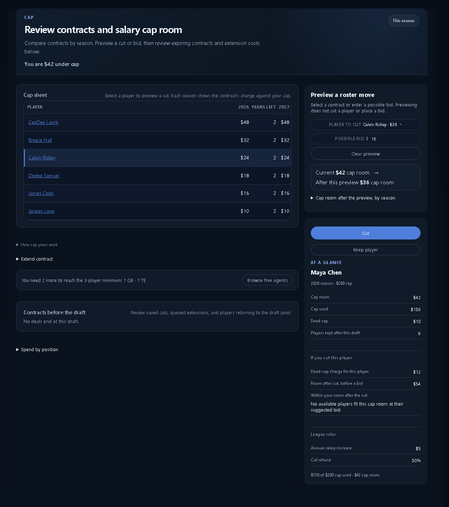
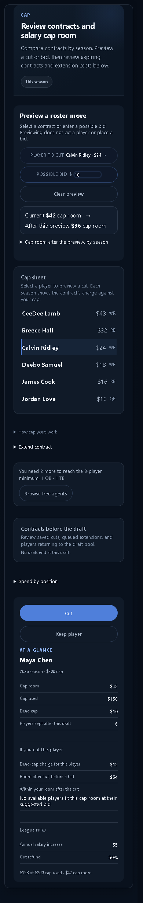

# Cap contract workbench

Implements the selected option B: desktop contracts first, with a cut/bid preview beside the sheet. Phone shows the preview before the contract rows. Contract selection works with a keyboard. Extensions, cap-year explanations, and spending remain available through disclosures.

Copy distinguishes current cap room, a hypothetical result, and the selected player's dead-cap charge. A possible bid affects only this season; future-year previews do not invent a new contract. Cut confirmation and the existing acquisition handoff remain unchanged.

## Verification

The real CapPlanner component was bundled with representative fixture contracts and the product styles. No production data or writes were used.

| Check | Result |
| --- | --- |
| Layout audit, 1280px | PASS, all rules |
| Layout audit, 390px | PASS, all rules |
| Selection, bid preview, over-cap, clear preview | PASS at both widths |
| Spending/year disclosures, empty and non-salary states | PASS at both widths |
| Cap and living-surface frontend tests | 36 passed |
| Product constitution and living-surface pytest | 34 passed |
| Production frontend build | PASS |

Full frontend suite: 782/788 passed. All six failures reproduce on unchanged base commit `3eac9d2`: draft-availability callback source check, auction contract label, two roster contract-label/schedule checks, accuracy null handling, and DFS Edit Entries output.

The fixture was visually inspected at 1280px and 390px. The authenticated `/hub/cap` page, My team, Rules, loading/error fetch states, and real cut/extension persistence were not exercised. The worktree API could not start without its JWT configuration, and the existing Vite server serves another checkout. These screenshots verify the component layout, not the full authenticated application shell.

## Screenshots

