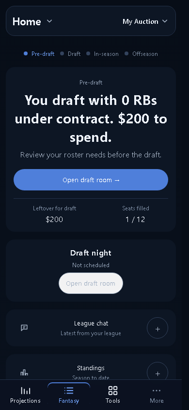
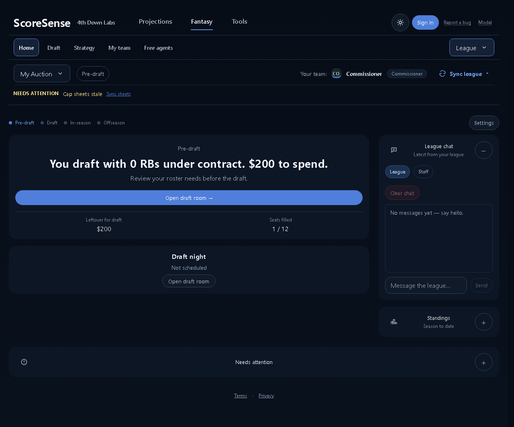
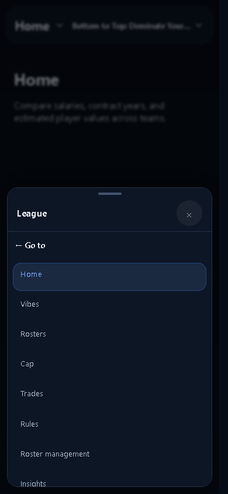

# Consistent Fantasy headers

Fantasy, Projections and Tools share the same rounded phone shell, title hierarchy, chevron and insets. Every Fantasy phone destination uses the title picker without a duplicate navigation row. League leads that picker, Home leads League, and entering Fantasy from another area opens Home. Strategy and Draft disappear after the selected league's draft is complete; solo practice and pre-draft leagues retain them. Other useful league destinations remain subject to their existing capability and staff gates.

The current approved Home page remains in place. Screenshots show the local My Auction snapshot, which is pre-draft; in-season navigation uses a production-component fixture. The branch starts from current develop, whose Home UI matches the shipped design. Unrelated changes in the original checkout are preserved.

| Header and overflow audit | 390px | 1280px |
| --- | --- | --- |
| All 34 registered routes | PASS | PASS |

The route gate is phone-chrome / overflow, plus desktop-league at 1280. Other page craft checks are outside this header change. The audit assertion covers corner radius, equal insets, compact height, bold title size, and absence of an extra divider. [Route results](route-checks.json).

116 production-component layouts pass at 320, 390 and 1280 in light and dark modes, covering every Fantasy destination and all Projections / Tools tabs. Menu checks cover League/Home order, draft phase transitions, salary and non-salary leagues, member permissions, Escape focus return, and GET-only interactions. [Fixture results](checks.json).

The running app was also exercised from My team to Tools to Fantasy; Fantasy opens Home. Empty and loading local data retain the header. Live draft controls, public shared rooms, production league data, and roster/scoring writes were not exercised.

Validation: production build passed; 32 focused frontend/audit tests and 36 product/registry Python tests passed. The full frontend suite has 908 passes out of 911, with three existing failures: old Rookie contract wording in draftRoomHelpers, null accuracy handling, and the stale My team registry assertion. The registry failure also reproduces against unmodified origin/develop.

## Screenshots

[Phone Home](home-390.png) · [Desktop Home](home-1280.png) · [In-season League menu](league-menu-390.png) · [Weekly](weekly-390.png) · [DFS](dfs-390.png)

