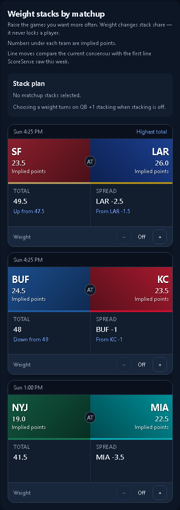
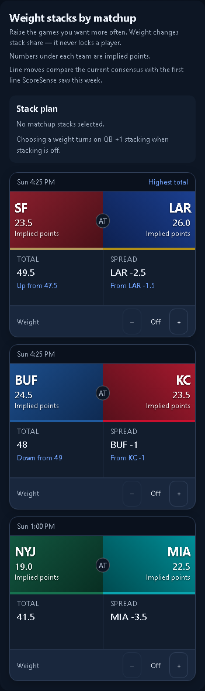
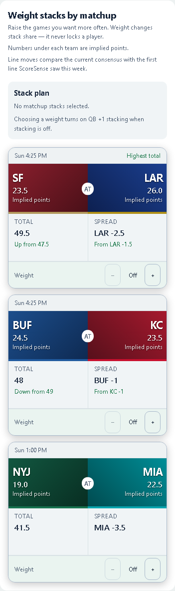

# DFS coverage UI — option A

The approved layout works with DraftKings Classic, FanDuel Classic, season-long, and single-game formats. Classic/season-long retain the game board: team graphics, implied points, current totals and spreads, movement against the first observed line, and stack weights. Captain controls stay in single-game formats.

Coverage appears beside the pool. Available, unavailable, and missing-estimate groups are distinct; missing identities/reasons and projection import open inline. Every row shows its estimate source, and the source summary counts available players. Pool checks and projection refreshes have separate timestamps and failure states.

## Verification

Real React components at `/test-fixtures/dfs-workspace.html?state=coverage`, with deterministic illustrative responses. These are UI checks, not live-provider or optimizer correctness checks.

| Check | 1280 | 390 |
| --- | --- | --- |
| Repository layout audit, all rules | PASS | PASS |
| Classic / FanDuel Classic / season-long | PASS | PASS |
| Showdown layout and single-game format switching | PASS | PASS |
| Classic game cards, dark and light | PASS | PASS |
| Missing estimate review and unavailable filter | PASS | PASS |
| Projection import, ownership column, source count | PASS | PASS |
| Game-weight and lock values sent to build | PASS | PASS |
| Server staleness / failed fetch / recovery | PASS | PASS |
| Empty / loading / error / read-only states | PASS | PASS |
| JavaScript errors | None | None |

Importing complete projections moves a missing player into the available count, records Imported as the source, and survives the next pool refresh. Line-movement checks include totals rising/falling, a favorite changing, and no fabricated movement when a baseline is absent. The existing Captain verifier also passed its saved-input and refresh regression checks at both widths.

- Focused coverage/presentation unit tests: **32 passed**.
- Product/living-surface checks: **35 passed**.
- Frontend production build: **passed**.
- Complete frontend unit suite: **866 passed, 4 known failures** in unchanged contract-label/salary-format and accuracy-copy tests.
- No production authenticated route, live provider, or backend optimizer integration was checked. The API is simulated for these previews.

Run `node scripts/dev/verify_dfs_coverage.mjs` with Vite on 5173 to reproduce the interactive checks. `report.json` records each layout rule by state and width.

## Screenshots

Visually inspected desktop/phone coverage, Classic game cards in both themes, and the Showdown layout.

[Classic desktop](classic-1280.png) · [Classic phone](classic-390.png) · [Coverage review](coverage-1280.png) · [Showdown desktop](showdown-1280.png) · [Showdown phone](showdown-390.png)

