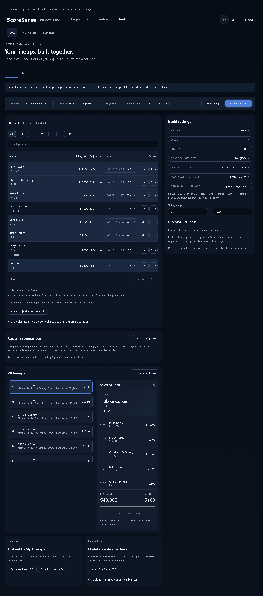
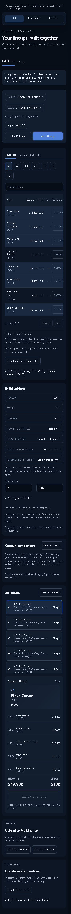

# DFS projection freshness review

Real DFS components with mocked API responses; not authenticated production/provider verification.

| Viewport | Refresh controls | Layout (11 rules) |
|---|---|---|
| 1280 | PASS | PASS |
| 390 | PASS | PASS |

`verify_dfs_captain.mjs` invokes the real five-minute callback: changed pool values appear, saved input snapshots remain identical, failures retain the prior pool and recovery clears the error. Existing format/snapshot binding checks also pass. `verify_dfs_comparison.mjs` passes complete, partial, infeasible, error, mismatch, loading, readonly, empty and stale-response states. Screenshots are generated at `outputs/dfs-captain/captain-{1280,390}.png` and were inspected locally. No layout/CSS redesign.

Backend regression and production build results are recorded in the PR. Four pre-existing frontend unit failures remain in contract labels/salary display and accuracy copy.

