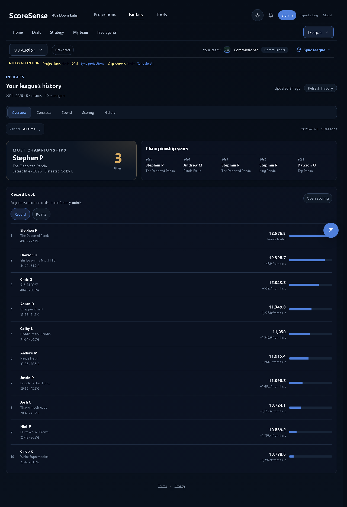
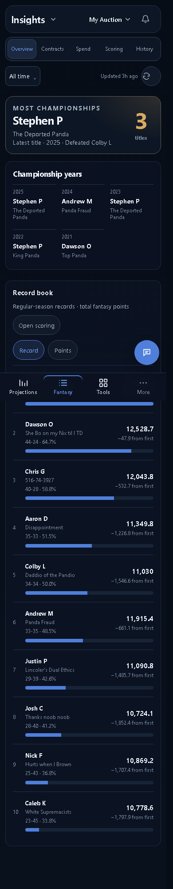
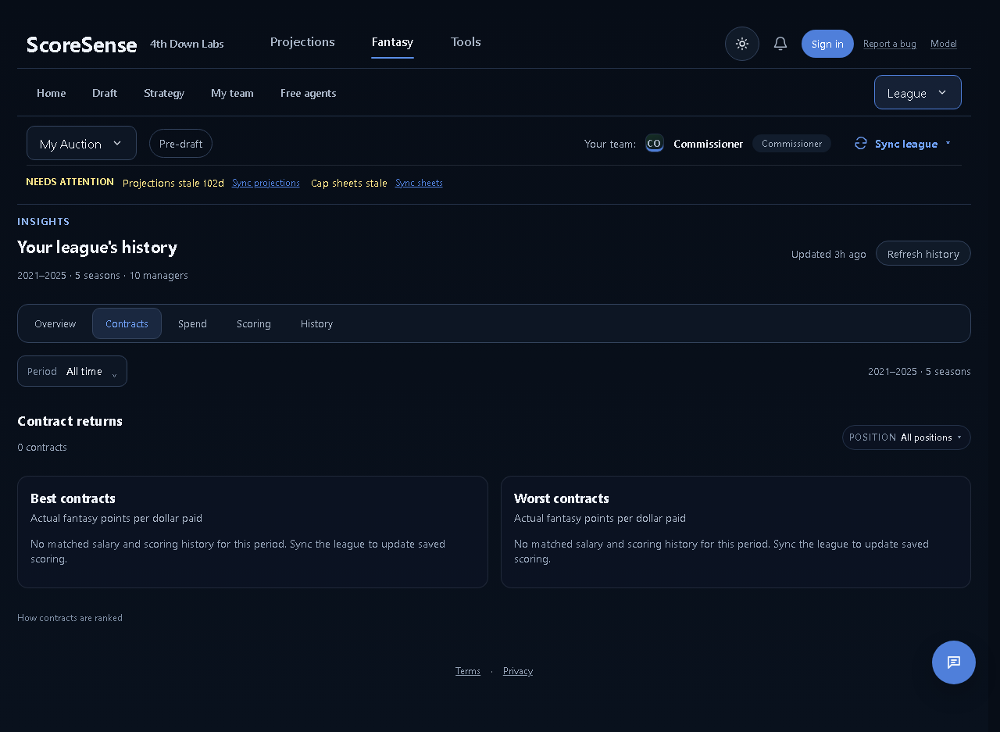
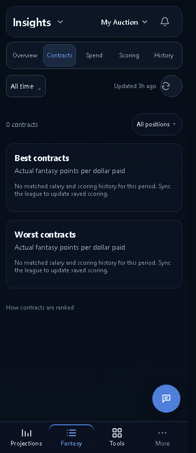

# League Insights B review

Implemented the approved B record book and compact phone header. Overview and Contracts share All time, individual years, Last 3 years, and a custom range. Filters aggregate saved data locally. Contracts rank actual fantasy points per annual salary; missing production stays unavailable and recorded zero production counts.

Based on master `acec4273`, including the cached-page recovery merge. The recovery browser suite passed all 18 cases.

## Running-app checks

Chromium, local saved My Auction snapshot, API on 8000 and Vite on 5173. Workspace response selection pins the snapshot league; Insights data comes from the real local API. Browser-only fixture responses exercise populated contract rankings without writing sample data to the database.

| Surface | 1280 | 390 |
| --- | --- | --- |
| Overview | PASS | PASS |
| Contracts | PASS | PASS |
| Spend | PASS | PASS |
| Scoring | PASS | PASS |
| History | PASS | PASS |

No horizontal page overflow at 320. No browser runtime errors. Loading, empty history, populated contracts, recorded zero production, position selection, keyboard range selection, Escape dismissal, and a failed explicit refresh passed. Period changes made no API requests. The selected tab and actual Contracts body are asserted, including direct route parsing.

Entry from an already loaded Fantasy workspace measured 286 ms at 1280, 220 ms at 390, and 227 ms at 320. Last 3 years selection measured 40 ms. These are local browser measurements, not a production network or cold full-app guarantee.

The saved snapshot has no matched contract salary/production history, so the actual Contracts screenshots show the empty state. Explicit history refresh or league sync fills saved scoring; incomplete or ambiguous records are excluded.

## Local checks

- Backend Insights/history/identity/contract and product checks: 88 passed.
- Final focused frontend route/period/identity checks: 41 passed.
- Production frontend build: PASS.
- Full frontend suite: 966 passed, 3 existing failures outside Insights: auction contract copy, missing accuracy value, and the My team living-surface expectation. The corresponding behavior was not changed by this PR.

Safari, physical iPhone hardware, and other product destinations were not rechecked. Spend, Scoring, and History retain their detailed season controls; the shared range applies to Overview and Contracts.

## Screenshots

The exact audit and timing records are in [pr-review.json](pr-review.json). Reproduce with `node scripts/dev/insights_pr_review.mjs` and `node scripts/dev/insights_states_review.mjs` against the local snapshot.
