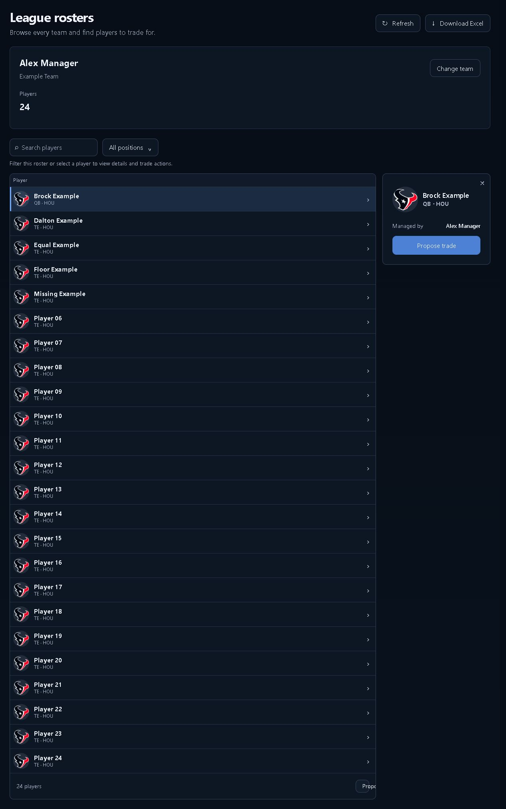
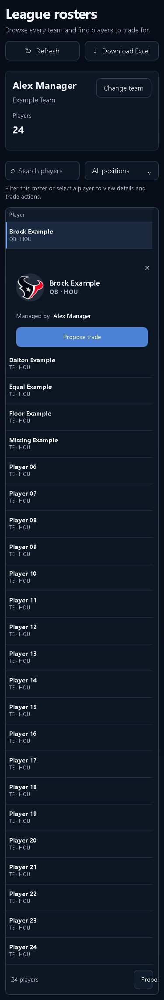

# Non-salary roster verification

Actual LeagueRostersBrowser component rendered with synthetic roster data and non-salary capabilities. The fixture intentionally retains salary/cap/contract fields to check that the UI hides them.

- Saved Contract values preference opens the manager directory instead.
- Selecting Alex Manager shows all 24 players, including missing-estimate and minimum-bid players.
- Details open only on selection and show player identity, manager and trade action, without salary, contract or history UI.
- Layout audit: 1280 PASS; 390 PASS. Screenshots show the selected-player state at both widths.
- 24 focused Node tests and 34 product/living-surface tests passed. Production build passed.
- Full frontend suite: 793 passed, 6 existing failures (availability locked night, auction contract label, contract type labels, flat salary display, accuracy copy, DFS Edit Entries).

Scope: component fixture, not an authenticated live non-salary league. Cap, My team, Rules and workbook download were not retested. No deployment.

