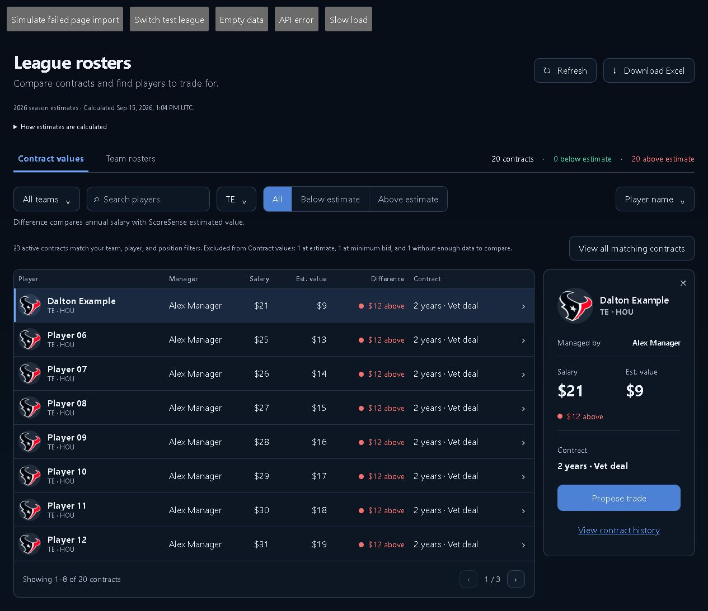
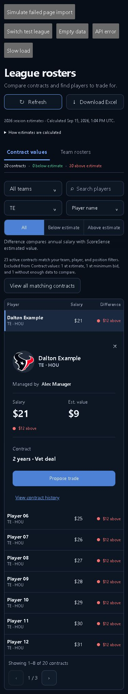
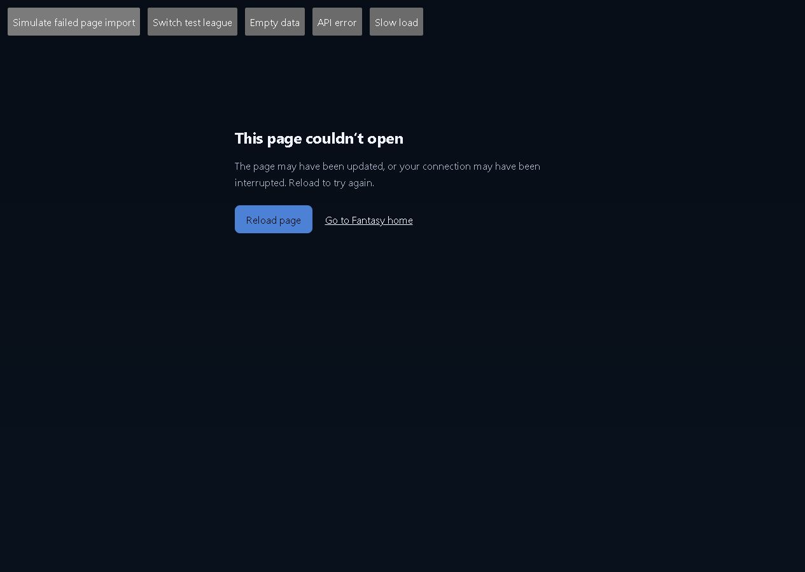
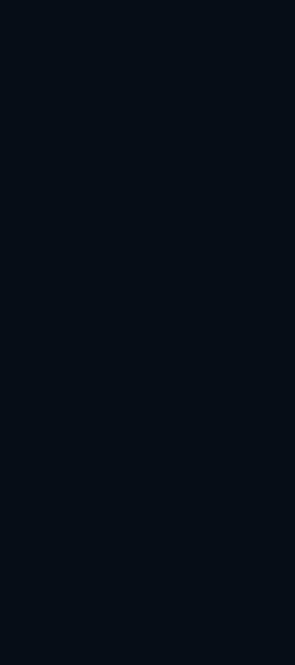

# Rosters audit fixes: verification

These screenshots show the actual changed React components bundled together with synthetic roster data. The gray test controls belong only to the local fixture. They are not product changes.

The five branches target `develop` independently: `codex/rosters-load-recovery`, `codex/rosters-estimate-coverage`, `codex/rosters-browsing-state`, `codex/rosters-detail-dismissal`, and `codex/rosters-estimate-context`. All five applied together without conflicts in a separate verification branch.

## Checks

- Production Vite build: PASS.
- Focused frontend tests: 20 PASS (presentation, coverage, storage validation/isolation, minimum-bid handling, timestamp copy).
- Backend tests: 23 PASS (`test_roster_estimate_context.py` and `test_pre_draft_cap.py`).
- Full frontend suite: 787 PASS, 6 FAIL. All six failures reproduced on unchanged `develop` at `ecc74f5`: draft availability load, locked auction contract label, contract-type copy, flat salary schedule copy, accuracy copy, and DFS Edit Entries. None is introduced by these changes.
- `git diff --check`: PASS.

| Layout audit | 1280 | 390 |
| --- | --- | --- |
| Actual Rosters component fixture | PASS | PASS |

The repository `layout_audit.mjs` ran against the fixture using `LAYOUT_AUDIT_BASE=http://127.0.0.1:5174`. This is component layout verification, not an authenticated whole-app route audit.

Browser interaction checks passed:

- Close details, go to the next page, then filter: details stay closed until a player is selected.
- TE filter, name sort, page two, selected player -> trade handoff -> browser Back: all four choices restored.
- Contract history handoff -> browser Back: page and player restored.
- Switch leagues and return: each league restores its own browsing state.
- View all matching contracts: equal, missing-estimate, and minimum-bid rows become visible while team/player/position filters remain.
- Minimum-bid row: no above/below comparison; explanation available in details.
- Rejected React.lazy import: recovery UI renders; clicking Reload returns to the board. No automatic reload loop.
- Empty data, loading, and API error: readable states; Refresh remains available after an API error.

Not checked in this pass: production deployment, authenticated full-app integration, full Trade/History destinations, Cap/My team/Rules regression navigation, Excel export, or live league mutations. Trade and History callbacks were verified through local navigation fixtures. The saved estimate calculation time is not a claim about the age of underlying projection inputs.

## Screenshots

### Rosters, desktop

### Rosters, phone

### Load recovery, desktop

### Load recovery, phone

