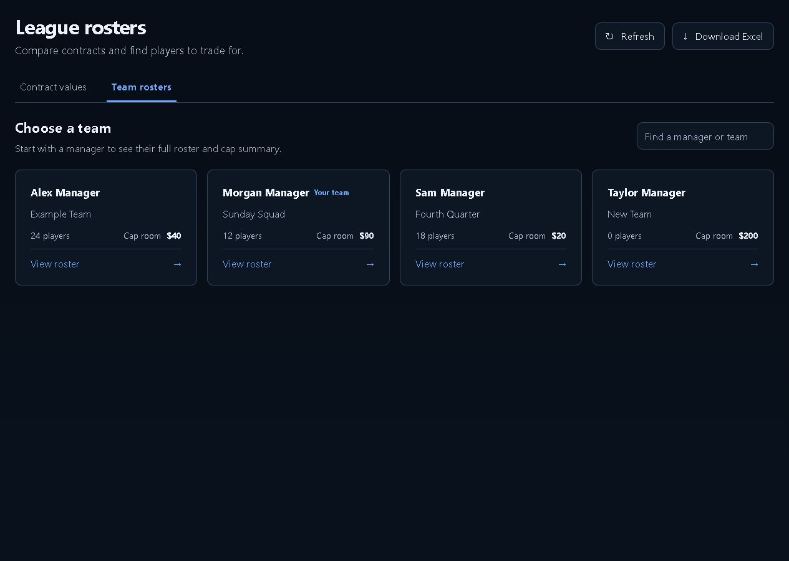
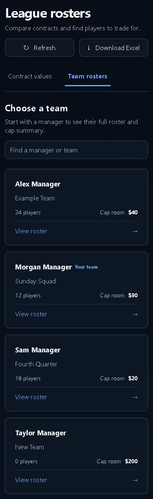
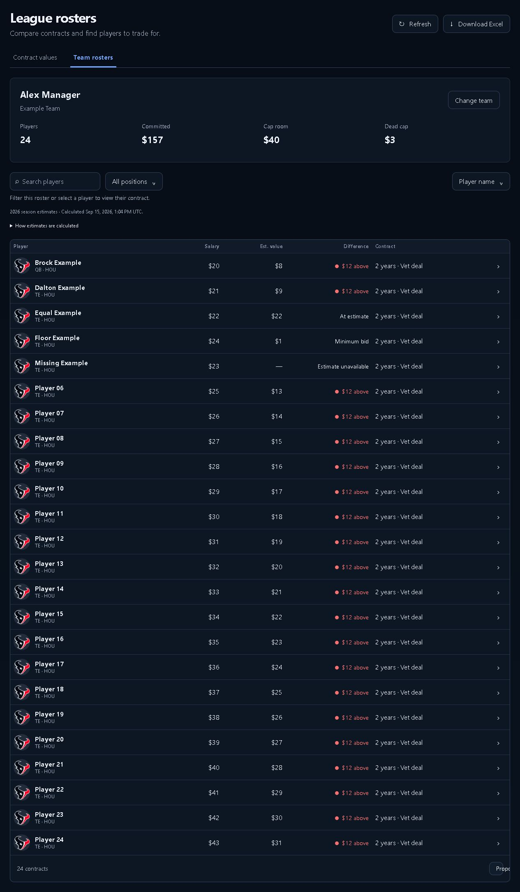
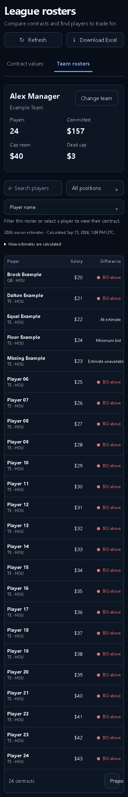

# Team-first Rosters follow-up

Team rosters now opens a searchable manager directory. Choosing a manager shows that team's cap summary and complete active roster, with no eight-player pagination or hidden value filter. Change team returns to the directory. Contract values keeps its comparison filters and pagination.

Neither tab selects the first player automatically. A contract opens only after an explicit player choice; that choice can still be restored when returning from Trade or History.

## Validation

- Production build: PASS.
- Focused frontend tests: 45 PASS, including fresh/stale selection, explicit selection, full-roster display, and existing state/estimate helpers.
- Product/living-surface Python tests: 34 PASS.
- Full frontend suite: 790 PASS, 6 existing FAIL (the same draft availability, auction/contract labels, salary schedule, accuracy, and DFS Edit Entries failures documented in the prior Rosters PRs).
- `git diff --check`: PASS.

| Actual-component fixture | 1280 | 390 |
| --- | --- | --- |
| Manager directory | PASS | PASS |
| Selected team / full roster | PASS | PASS |
| Contract values | PASS | PASS |

Browser checks passed: first load and comparison pagination do not open details; manager search; all 24 active players visible on the selected test team; no automatic selection on choosing a team; filters/reset retain the chosen team; explicit Player 24 selection survives trade handoff and Back; empty team; read-only trade disabled; phone details render inline and close; Change team returns to the directory. The team-level trade action remains available in the roster footer.

Verification used the actual React components with synthetic local data. Production deployment, full authenticated Trade/History destinations, Excel download, and Cap/My team/Rules navigation were not tested or changed in this pass. The live page was inspected and still showed the older UI; this PR does not deploy it.

## Desktop directory

## Phone directory

## Selected roster on desktop

## Selected roster on phone

